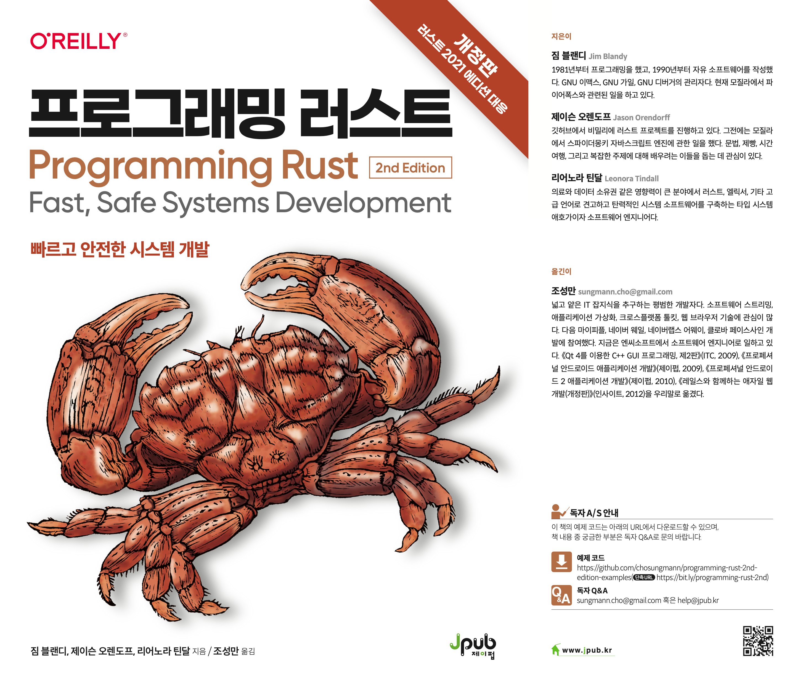
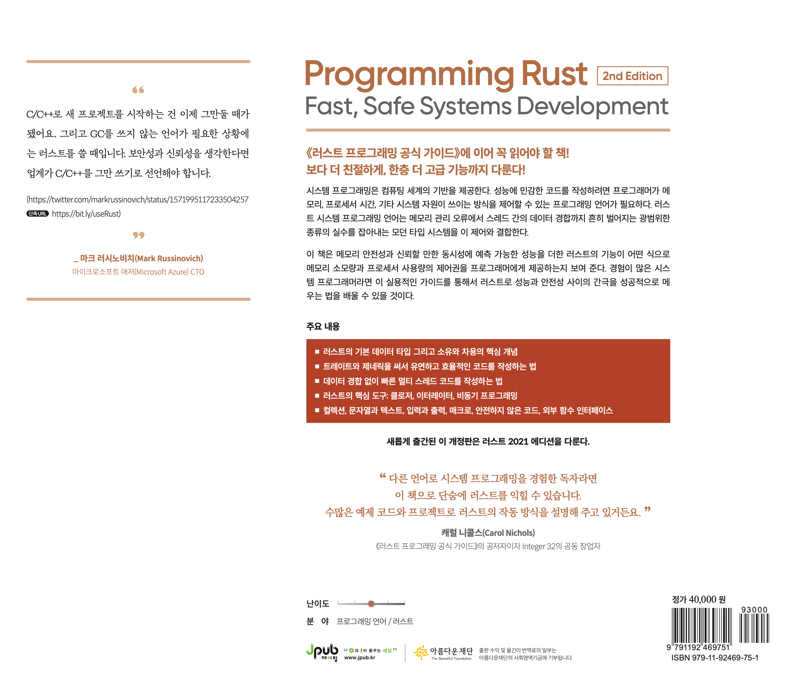

# 프로그래밍 러스트: 빠르고 안전한 시스템 개발, 개정2판

  
  

[정오표](https://jpub.tistory.com/1375) | 
[교보문고](https://product.kyobobook.co.kr/detail/S000200629958) | 
[알라딘](https://www.aladin.co.kr/shop/wproduct.aspx?ItemId=308448819) | 
[예스24](http://www.yes24.com/Product/Goods/116789691)

## 책 소개

> "다른 언어로 시스템 프로그래밍을 경험한 독자라면 이 책으로 단숨에 러스트를 익힐 수 있습니다. 수많은 예제 코드와 프로젝트로 러스트의 작동 방식을 설명해 주고 있거든요."
>
> —캐럴 니콜스Carol Nichols, 《러스트 프로그래밍 공식 가이드》의 공저자이자 Integer 32의 공동 창업자

《러스트 프로그래밍 공식 가이드》에 이어 꼭 읽어야 할 책! 보다 더 친절하게, 한층 더 고급 기능까지 다룬다!

시스템 프로그래밍은 컴퓨팅 세계의 기반을 제공한다. 성능에 민감한 코드를 작성하려면 프로그래머가 메모리, 프로세서 시간, 기타 시스템 자원이 쓰이는 방식을 제어할 수 있는 프로그래밍 언어가 필요하다. 러스트 시스템 프로그래밍 언어는 메모리 관리 오류에서 스레드 간의 데이터 경합까지 광범위한 종류의 실수를 잡아내는 모던 타입 시스템과 이 제어를 결합한다.

이 책은 메모리 안전성과 신뢰할 만한 동시성에 예측 가능한 성능을 더한 러스트의 기능이 어떤 식으로 메모리 소모량과 프로세서 사용량의 제어권을 프로그래머에게 제공하는지 보여 준다. 경험이 많은 시스템 프로그래머라면 이 실용적인 가이드를 통해서 러스트로 성능과 안전성 사이의 간극을 성공적으로 메우는 법을 배울 수 있을 것이다.

주요 내용:

* 러스트의 기본 데이터 타입 그리고 소유와 차용의 핵심 개념

* 트레이트와 제네릭을 써서 유연하고 효율적인 코드를 작성하는 법

* 데이터 경합 없이 빠른 멀티 스레드 코드를 작성하는 법

* 러스트의 핵심 도구: 클로저, 이터레이터, 비동기 프로그래밍

* 컬렉션, 문자열과 텍스트, 입력과 출력, 매크로, 안전하지 않은 코드, 외부 함수 인터페이스

새롭게 출간된 이 개정판은 러스트 2021 에디션을 다룬다.

### 지은이 · 옮긴이 소개

<b>[짐 블랜디Jim Blandy](https://twitter.com/jimblandy)</b> 1981년부터 프로그래밍을 했고, 1990년부터 자유 소프트웨어를 작성했다. GNU 이맥스, GNU 가일, GNU 디버거의 관리자다. 현재 모질라에서 파이어폭스와 관련된 일을 하고 있다.

<b>[제이슨 오렌도프Jason Orendorff](https://twitter.com/jorendorff)</b> 깃허브에서 비밀리에 러스트 프로젝트를 진행하고 있다. 그전에는 모질라에서 스파이더몽키 자바스크립트 엔진에 관한 일을 했다. 문법, 제빵, 시간 여행, 그리고 복잡한 주제에 대해 배우는 이들을 돕는 데 관심이 있다.

<b>[리어노라 틴달Leonora Tindall](https://twitter.com/NoraDotCodes)</b> 의료와 데이터 소유권 같은 영향력이 큰 분야에서 러스트, 엘릭서, 기타 고급 언어로 견고하고 탄력적인 시스템 소프트웨어를 구축하는 타입 시스템 애호가이자 소프트웨어 엔지니어다.

<b>[조성만](https://twitter.com/chosungmann)</b> 넓고 얕은 IT 잡지식을 추구하는 평범한 개발자다. 소프트웨어 스트리밍, 애플리케이션 가상화, 크로스플랫폼 툴킷, 웹 브라우저 기술에 관심이 많다. 다음 마이피플, 네이버 웨일, 네이버랩스 어웨이, 클로바 페이스사인 개발에 참여했다. 지금은 엔씨소프트에서 소프트웨어 엔지니어로 일하고 있다. 《Qt 4를 이용한 C++ GUI 프로그래밍, 제2판》(ITC, 2009), 《프로페셔널 안드로이드 애플리케이션 개발》(제이펍, 2009), 《프로페셔널 안드로이드 2 애플리케이션 개발》(제이펍, 2010), 《레일스와 함께하는 애자일 웹 개발, 개정판》(인사이트, 2012)을 우리말로 옮겼다.
